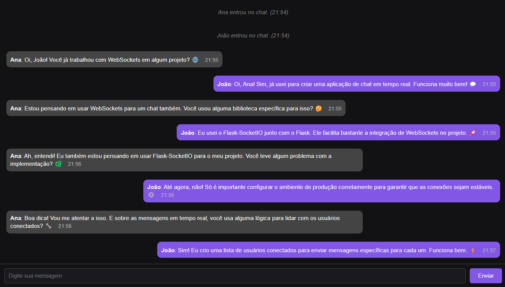

# 💬 Aplicação de Chat em Tempo Real

Este projeto implementa um sistema de chat em tempo real utilizando Flask e WebSockets. Ele permite que múltiplos usuários se conectem ao mesmo canal de chat e troquem mensagens instantaneamente. 📨



## 🚀 Tecnologias Utilizadas

- 🐍 **Python**: Linguagem principal para o desenvolvimento.
- 🌐 **Flask**: Framework web leve utilizado para criar a aplicação.
- 🔌 **Flask-SocketIO**: Biblioteca para integração de WebSockets com Flask.
- ⚡ **Socket.IO**: Protocolo utilizado para comunicação em tempo real entre o servidor e os clientes.

## ✨ Funcionalidades

- 💬 Comunicação em tempo real entre usuários.
- 🆔 Identificação de usuários com nomes personalizados.
- 📢 Mensagens do sistema notificando entrada e saída de usuários.
- 🖥️ Interface web para interação com o chat.

## 🔧 Pré-requisitos

- Python 3.7+
- Gerenciador de pacotes `pip`

## ⚙️ Configuração do Ambiente

1. Clone este repositório:
   ```bash
   git clone https://github.com/joschonarth/flask-websocket-chat
   cd flask-websocket-chat
   ```

2. Crie um ambiente virtual (opcional):
   ```bash
   python -m venv venv
   ```

   2.1 Ative o ambiente virtual:
   ```bash
   source venv/bin/activate  # Linux/Mac
   venv\Scripts\activate   # Windows
   ```


3. Instale as dependências:
   ```bash
   pip install -r requirements.txt
   ```

4. Crie um arquivo `.env` na raiz do projeto e configure a chave secreta:
   ```
   SECRET_KEY=sua_chave_secreta
   ```

## ▶️ Execução

1. Inicie o servidor:
   ```bash
   python app.py
   ```

2. Acesse o aplicativo no navegador em:
   ```
   http://localhost:5000
   ```

## 📂 Estrutura do Projeto

```
flask-websocket-chat
│
├── app.py                # Arquivo principal da aplicação
├── templates
│   └── index.html        # Interface do chat
├── static
│   └── styles.css        # Arquivo de estilização
├── requirements.txt      # Dependências do projeto
├── .env                  # Configuração de variáveis de ambiente
└── README.md             # Documentação do projeto
```

## 🔗 Endpoints

- **`GET /`**: Carrega a página principal do chat.

## 📡 Eventos Socket.IO

- **`connect`**: Dispara quando um usuário se conecta.
- **`disconnect`**: Dispara quando um usuário se desconecta.
- **`set_username`**: Configura o nome de usuário e notifica os participantes.
- **`message`**: Recebe e retransmite mensagens para os participantes.


## 🤝 Contribuição

Contribuições são bem-vindas! Sinta-se à vontade para abrir issues ou enviar pull requests.

## 📝 Licença

Este projeto está licenciado sob a MIT License. Veja o arquivo LICENSE para mais detalhes.
